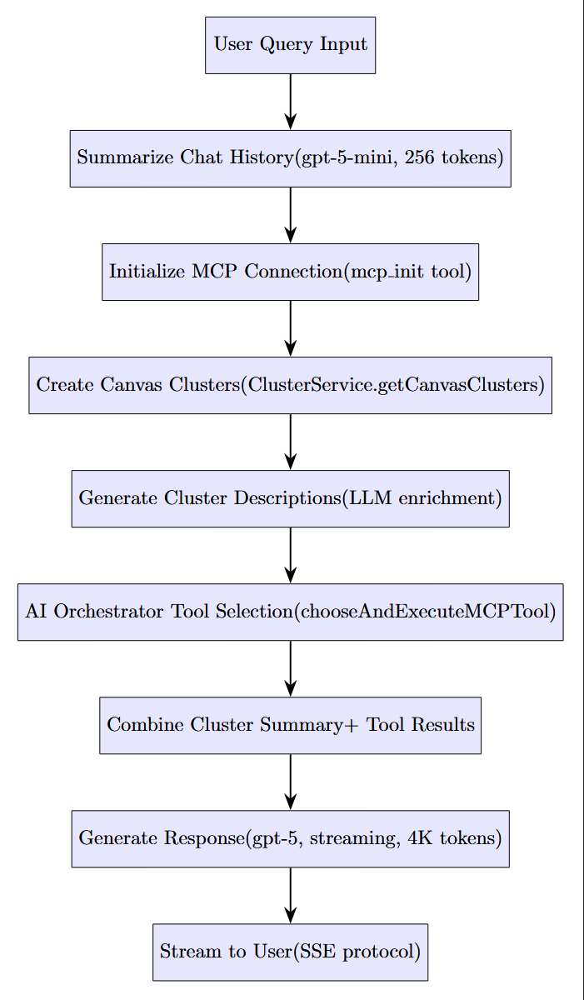
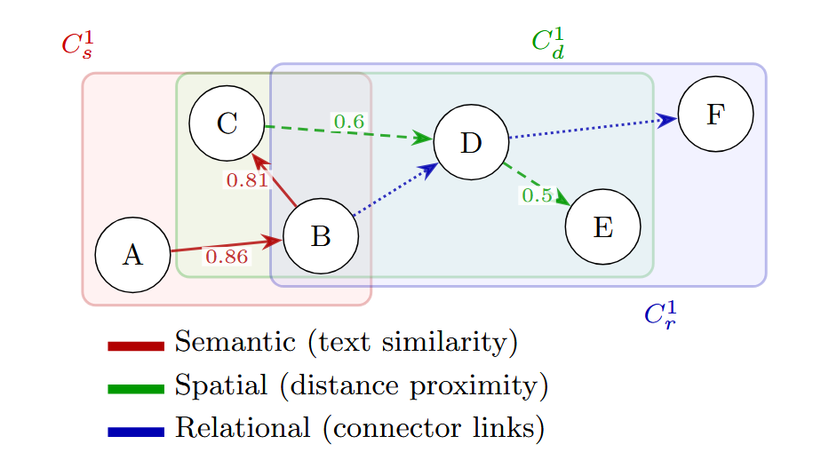

# Treyspace SDK

[](https://opensource.org/licenses/MIT)
[](https://nodejs.org/)
[](https://www.typescriptlang.org/)
[](CONTRIBUTING.md)
[](https://github.com/L-Forster/treyspace-sdk/stargazers)

An open-source RAG (Retrieval-Augmented Generation) SDK for canvas-based knowledge graphs. It ingests canvas data, mirrors it into Helix graph-vector database for semantic, relational, and spatial clustering, and provides LLM-powered analysis of the canvas.


A hosted version of the Treyspace SDK with a full user interface and an Excalidraw canvas is available:

**Try it here:** [https://treyspace.app/](https://treyspace.app/)


<div align="center" style="display: flex; justify-content: center; gap: 40px; flex-wrap: wrap;">

  <div>
    
    <br/>
    <em>Figure: End-to-end canvas-to-Helix-to-LLM pipeline</em>
  </div>

  <div>
    
    <br/>
    <em>Figure: Semantic, relational, and spatial cluster visualization</em>
  </div>

</div>


## Features

- **Responses API** – Wrapper around OpenAI responses API with canvas-specific context handling
- **Canvas AI engine** – SSE endpoints under `/api/ai/*` orchestrate the full RAG pipeline with graph-based retrieval
- **Helix bridge** – `/api/clusters` and `/api/mcp-bridge` proxy the Helix graph database for semantic clustering
- **SDK & Server** – Use as a library or run as a standalone server
- **Development-focused** – No auth, rate limiting, or billing; easily adaptable to your needs

## Table of Contents

- [Features](#-features)
- [Quick Start](#-quick-start)
- [Architecture](#-architecture)
- [Usage](#-usage)
- [Documentation](#-documentation)
- [Examples](#-examples)
- [Environment Variables](#-environment-variables)
- [Development](#-development)
- [Contributing](#-contributing)
- [License](#-license)

## Quick Start

### Prerequisites

- Node.js >= 18.0.0
- npm >= 9.0.0
- OpenAI API key
- Helix DB instance (optional - can run with in-memory mode)

### Installation

1. **Clone and install**

   ```bash
   npm install
   ```

2. **Copy the default config**

   ```bash
   cp .env.example .env
   ```

   - Only set `OPENAI_API_KEY` to run locally.
   - **Helix is optional** – By default, the SDK uses an in-memory graph store. To use HelixDB instead, pass `--enable_helix` when starting the server or follow the [Helix install guide](https://docs.helix-db.com/documentation/getting-started/installation).

3. **Start the SDK façade**

   ```bash
   cd sdk
   npm install
   node server.js
   ```

   Leave this process running (or use your favourite watcher).

4. **Start the backend (new terminal)**

   ```bash
   cd ..
   node src/index.js
   ```

5. **Verify the pipeline**
   ```bash
   npm run smoke              # health check (requires servers from steps 3 & 4)
   npm run test:smoke         # requires OPENAI_API_KEY
   npm run test:integration   # full pipeline (OPENAI_API_KEY required)
   npx tsx tests/runFullPipeline.spec.mjs   # full pipeline using in-memory mode (default)
   ```
   The `test:*` commands start (and stop) both the SDK façade and the AI proxy automatically and skip if `OPENAI_API_KEY` is not set.

### Helix Database (Optional)

By default, the SDK runs with an **in-memory graph store** – perfect for development, testing, or lightweight deployments. To enable the full HelixDB backend for production use:

```bash
# Start the façade with HelixDB enabled
node sdk/server.js --enable_helix

# The default (in-memory) mode requires no additional flags
node sdk/server.js
```

## Project Structure

```
├── src/                # Backend server and AI engine
├── sdk/               # Helix SDK integration layer
├── docs/               # API + configuration docs
├── examples/           # Client scripts for testing
├── scripts/            # Smoke check utility
├── tests/              # End-to-end tests
└── .github/            # CI workflow
```

## Documentation

- [API Reference](./docs/API.md) – endpoints and payloads
- [Configuration & Deployment](./docs/CONFIGURATION.md) – Environment variables, Docker, and Helix setup
- [Pipeline Guide](./docs/EXCALDRAW_PIPELINE.md) – Step-by-step canvas processing workflow


## Examples

- `examples/responses.mjs` – POST a one-off prompt to `/v1/responses`
- `examples/stream-ai-engine.mjs` – Stream `/api/ai/engine` SSE output for a board

```bash
node examples/responses.mjs "Summarise this Excalidraw canvas"
# or load a full request
node examples/responses.mjs --payload ./payload.json

AI_BACKEND_BOARD_ID=board-123 node examples/stream-ai-engine.mjs
```

Set `AI_BACKEND_URL` to override the backend URL for proxied deployments.

### SDK Usage (as a library)

```javascript
import { createHelixRagSDK, executeFullPipeline } from 'treyspace-sdk';

// Create SDK instance
const sdk = createHelixRagSDK();

// Sync canvas data
await sdk.syncCanvas({
  boardId: 'my-board',
  excalidrawData: { elements: [...] }
});

// Get clusters
const clusters = await sdk.refreshClusters({ boardId: 'my-board' });

// Or run full pipeline
const result = await executeFullPipeline({
  boardId: 'my-board',
  userMessage: 'Explain this diagram',
  elements: canvasElements
});

console.log(result.text);
```

## Environment Variables

| Variable                                    | Description                             | Default                                       |
| ------------------------------------------- | --------------------------------------- | --------------------------------------------- |
| `NODE_ENV`                                  | `development`, `production`, or `test`. | `development`                                 |
| `PORT` / `HOST`                             | HTTP binding for the backend.           | `8787` / `0.0.0.0`                            |
| `LOG_LEVEL`                                 | Pino log level.                         | `info`                                        |
| `DEBUG` / `TREYSPACE_DEBUG`                 | Set to `1` to enable verbose logging.   | `0`                                           |
| `ALLOWED_ORIGINS`                           | Comma-separated CORS allow-list.        | `http://localhost:3000,http://localhost:5173` |
| `AI_BACKEND_URL` / `AI_BACKEND_PUBLIC_BASE` | Optional overrides for outbound URLs.   | –                                             |
| `OPENAI_API_KEY` (+ `OPENAI_DEFAULT_MODEL`) | Enables OpenAI routes.                  | – / `gpt-5-mini`                              |
| `HELIX_RAG_URL`                             | Base URL for the SDK façade.            | `http://localhost:3001`                       |
| `HELIX_INTERNAL_ORIGIN`                     | Origin header forwarded to the façade.  | `http://localhost:3000`                       |

## HTTP Surface

- `GET /healthz`
- `POST /v1/responses`
- `POST /api/ai/engine`
- `POST /api/clusters`
- `POST /api/mcp-bridge`


## Community

Connect with us on social media:

- [Twitter&nbsp;@FlouisLF](https://x.com/FlouisLF)  
- [Join our Discord community](https://discord.gg/pspKHtExSa)
## Testing & QA

```bash
npm run smoke  # requires server running in another shell
npx tsx tests/sdkSmoke.spec.mjs
npx tsx tests/runFullPipeline.spec.mjs  # uses in-memory mode by default
# To test with HelixDB
npx tsx tests/runFullPipeline.spec.mjs --enable_helix
```

## License

Released under the [MIT License](./LICENSE).


## Contributing
Contributions are welcome—fork this repo, create a feature branch, and submit a pull request. See [CONTRIBUTING.md](./CONTRIBUTING.md) for the full guidelines.

## Acknowledgements
Special thanks to the Helix DB and Excalidraw teams, whose tools enable Treyspace’s graph and canvas features.
